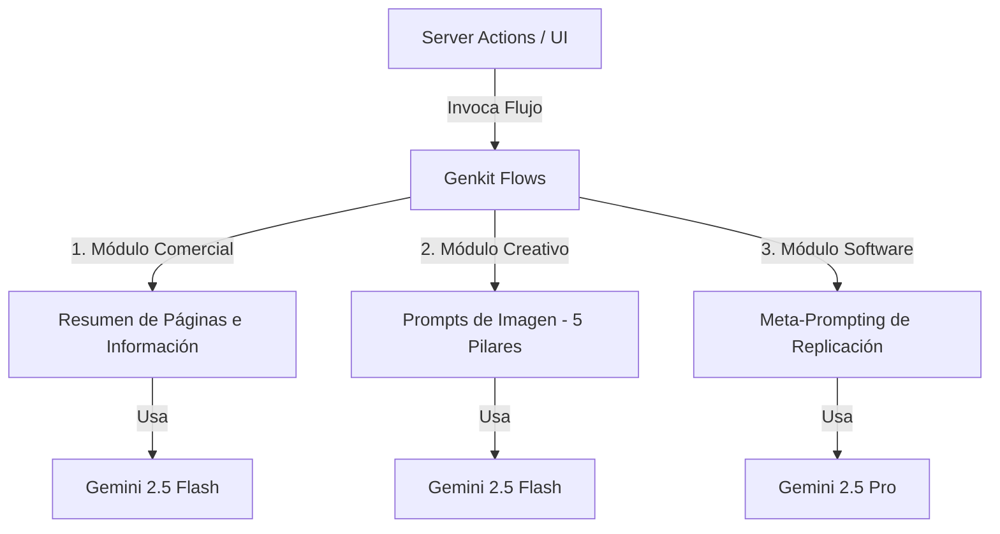

# Guía de Lógica Cognitiva de los Agentes y Flujos de IA

Este documento describe la arquitectura cognitiva, las reglas de generación de prompts y la lógica de negocio detrás de los agentes de Inteligencia Artificial de la plataforma. La IA del sistema actúa como un asistente especializado en enriquecer la propuesta de valor comercial de **Envíos DosRuedas**, automatizar el marketing visual de la marca y acelerar la ingeniería de software de la aplicación.

---

## 🎯 Estrategia de Razonamiento y Asignación de Modelos

El sistema optimiza el uso de modelos generativos (Google Gemini) asignándolos jerárquicamente de acuerdo al costo computacional y profundidad de razonamiento requerida por cada flujo de negocio:

1.  **Nivel de Latencia y Creatividad (`gemini-2.5-flash`):**
    *   **Uso:** Análisis de sentimientos rápidos, resúmenes cortos de testimonios y lluvia de ideas creativas de imágenes (backgrounds, aspectos, acciones).
    *   **Propósito:** Proporcionar respuestas casi instantáneas y eficientes para interacciones comerciales frecuentes.
2.  **Nivel de Razonamiento Profundo (`gemini-2.5-pro`):**
    *   **Uso:** Comprensión de código fuente estructurado, resolución de dependencias entre componentes y generación de instrucciones técnicas complejas (meta-prompting).
    *   **Propósito:** Procesar contextos extensos de programación sin pérdida de precisión ni alucinaciones lógicas.

---

## 📂 Lógica y Flujo Operativo de los Agentes

La plataforma organiza sus flujos cognitivos en tres módulos funcionales en el directorio `src/ai/flows/`:

### 1. Módulo de Resumen e Información Comercial
Este módulo analiza datos del negocio para sintetizar información clave:
*   **Análisis de Testimonios** ([summarize-testimonials.ts](file:///E:/proyectos/000pruebasenviosjunio/src/ai/flows/summarize-testimonials.ts)): Procesa textos y valoraciones de clientes para clasificar el sentimiento predominante, identificar fortalezas operativas (ej: velocidad de entrega) y detectar áreas de mejora.
*   **Resumen de Páginas de Servicios** ([summarize-service-page.ts](file:///E:/proyectos/000pruebasenviosjunio/src/ai/flows/summarize-service-page.ts)): Examina el código y contexto de un servicio de Next.js (como envíos Express o Low Cost) y sintetiza su propuesta de valor. Este resumen es inyectado dinámicamente como contexto en el sistema de prompts de otros agentes para asegurar consistencia en la comunicación de la marca.

---

### 2. Módulo Creativo y Prompts de Imagen (Fórmula de los 5 Pilares & Branding)
Diseñado para automatizar la creación de material visual publicitario de la marca de mensajería **Envíos DosRuedas** (identidad costera y urbana de Mar del Plata).

#### Lógica del Prompting de Imagen:
Para obtener imágenes de alta calidad (mediante modelos como Google Imagen), el sistema utiliza una estructura de **5 Pilares**:
`[Sujeto + Adjetivos] haciendo [Acción] en [Ubicación/Contexto]. [Composición/Ángulo de Cámara]. [Iluminación/Atmósfera]. [Estilo/Medio Visual]. [Restricciones de Texto/Branding].`

#### Restricciones de Identidad de Marca Inyectadas:
*   **Colores de Marca:** Azul marino primario y Amarillo secundario en elementos decorativos, bolsos y vehículos.
*   **Seguridad Vial:** Obligatoriedad de cascos de protección profesionales para todos los repartidores que aparezcan en escena.
*   **Contexto Geográfico:** Ubicación costera urbana basada en Mar del Plata (costanera, tránsito ágil, mar de fondo).

#### Flujos del Módulo:
*   **Lluvia de Ideas de Detalles** ([suggest-image-params.ts](file:///E:/proyectos/000pruebasenviosjunio/src/ai/flows/suggest-image-params.ts), [suggest-service-image-details.ts](file:///E:/proyectos/000pruebasenviosjunio/src/ai/flows/suggest-service-image-details.ts), [suggest-optimal-image-details.ts](file:///E:/proyectos/000pruebasenviosjunio/src/ai/flows/suggest-optimal-image-details.ts)): Analizan el tipo de servicio y proponen de 3 a 5 variaciones creativas para el fondo (ej: calles de Mar del Plata mojadas al amanecer) y la acción del repartidor.
*   **Compilador de Prompts** ([generate-image-prompt.ts](file:///E:/proyectos/000pruebasenviosjunio/src/ai/flows/generate-image-prompt.ts), [generate-service-image-prompt.ts](file:///E:/proyectos/000pruebasenviosjunio/src/ai/flows/generate-service-image-prompt.ts), [generate-optimal-image-prompt.ts](file:///E:/proyectos/000pruebasenviosjunio/src/ai/flows/generate-optimal-image-prompt.ts)): Toma las ideas seleccionadas de fondos, acciones y estilos visuales, y ensambla el prompt final en inglés respetando los 5 Pilares e inyectando las directrices de marca.

---

### 3. Módulo de Replicación de Software (Meta-Prompting)
Este módulo automatiza la generación de instrucciones técnicas detalladas orientadas a que otros asistentes de IA puedan clonar, migrar o reconstruir páginas y componentes del proyecto sin perder contexto.

#### Reglas de Separación de Responsabilidades en Next.js (Lógica de Arquitectura):
El agente de replicación analiza la estructura del código y divide las instrucciones del prompt según la arquitectura moderna de Next.js App Router:
*   **Server Components:** Instrucciones para layouts, loaders estáticos iniciales de LCP, y páginas que solo leen datos (SSR).
*   **Client Components:** Instrucciones de interactividad del lado del usuario (formularios reactivos, menús con estados Radix/ShadCN, y animaciones suaves con Framer Motion).
*   **Server Actions:** Lógicas de mutación de base de datos a desacoplar del cliente (APIs, consultas Prisma).

#### Flujos del Módulo:
*   **Replicación Estructural** ([generate-replication-prompt.ts](file:///E:/proyectos/000pruebasenviosjunio/src/ai/flows/generate-replication-prompt.ts), [generate-replication-prompt-v2.ts](file:///E:/proyectos/000pruebasenviosjunio/src/ai/flows/generate-replication-prompt-v2.ts)): Analiza páginas completas y genera las directrices arquitectónicas para recrear loaders, layouts y orquestar subcomponentes.
*   **Replicación de Componentes** ([generate-component-prompt.ts](file:///E:/proyectos/000pruebasenviosjunio/src/ai/flows/generate-component-prompt.ts)): Se enfoca específicamente en aislar la lógica de un conjunto de componentes interactivos y sus dependencias de diseño para recrearlos de manera limpia con TypeScript y Tailwind CSS.
